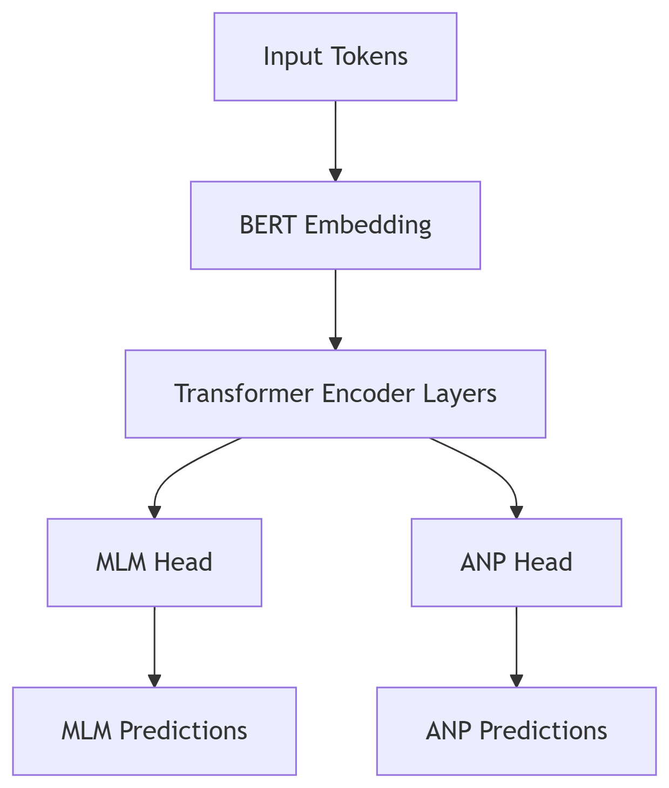

# 数据集
## 汇编指令归一化
### 原始方法：CP-BCS: Binary Code Summarization Guided by Control Flow Graph and Pseudo Code
+ Retaining all the mnemonics and registers.
+ Replacing all the constant values with \<Positive\>, \<Negative\> and \<Zero\>.
+ Replacing all internal functions with \<ICall\>.
+ Replacing all the destinations of local jump with \<JumpAddress\>.
#### 语义鸿沟问题：

汇编指令的自然语义密度远低于自然语言（如英文）

示例：mov eax, ebx 的语义信息量 ≈ 英文单词的 10-20%

导致模型难以从稀疏语义中学习有效表示

#### 特殊标记稀释问题：

每个 block 添加 <CLS>/<SEP> 后：
+ 原始指令序列：["push", "ebp", "mov", "ebp", "esp"]
+ 添加特殊标记后（指令数=5）：["\<CLS\>", "push", "ebp", "mov", "ebp", "esp", "\<SEP\>"]， 有效指令占比：5/7 ≈ 71%
+ 当 block 包含较少指令时，特殊标记占比过高（可能达 30-40%），稀释了有效语义
#### 指令级特征未利用：

未考虑：指令类型（算术/逻辑/存储），寄存器依赖关系，内存操作模式

### 优化方案：
#### 增强语义表示
显式编码语义特征，压缩词汇表规模
##### 将操作码映射到不同类别
原始: mov -> data_transfer:mov \
保留具体操作码同时添加语义类别 \
便于模型理解相似操作（如mov/lea同属数据传输）
  + data_transfer: 数据传送指令（如 mov, lea, xchg），负责在寄存器/内存间复制数据、计算地址或交换数据。
  + control_flow: 控制流指令（如 jmp, call, ret），实现跳转、函数调用、返回和条件分支。
  + arith: 算术运算指令（如 add, sub, mul），执行整数加减乘除等基础运算。
  + system: 系统/杂项指令（如 syscall, cpuid, cli），涵盖系统调用、中断、I/O、标志位操作等底层操作。
  + logic: 逻辑运算指令（如 and, or, shl），执行位操作（与/或/非/移位/旋转）。
  + stack: 栈操作指令（如 push, pop），专用于操作栈空间。
  + vector: 向量/SIMD指令（如 vpsrld, paddq），处理SSE/AVX等SIMD并行计算（浮点/整数向量）。
  + fpu: 浮点单元指令（如 fsqrt, fadd），执行浮点数运算和FPU栈操作。
  + crypto: 加密指令（如 aes, sha），实现AES、SHA等硬件加速加密算法。
  + nop: 空操作指令（nop），用于填充或延迟。
  + wait: 等待指令（pause），优化自旋锁性能。
  + string: 字符串操作指令（如 movs, scas），高效处理内存块（复制/比较/扫描）。
  + bit_manip: 位操作指令（如 popcnt），统计位数或前导零。
  + lock_prefix: 锁前缀（如 lock xadd），实现原子操作（多线程同步）。
  + rep_prefix: 重复前缀（如 rep stosq），循环执行字符串指令。
  + bounds_prefix: 边界前缀（如 bnd jmp），用于内存保护扩展（MPX）。
  + notrack_prefix: 不跟踪前缀（如 notrack call），跳过间接分支预测。
  + flag_operation: 标志操作指令（如 setb, sete），根据标志位设置字节值。  
  

##### 寄存器类别映射：
原始 eax -> \<REG:gpr\> \
统一不同架构寄存器表示（eax/rax → gpr） \
保留寄存器类别信息（通用/向量/浮点等） 
  - gpr:通用寄存器（如 rax, r15b, eax），存储数据和地址，覆盖8/16/32/64位尺寸。
  - segment: 段寄存器（如 cs, fs），管理内存分段（代码/数据/栈段）。
  - vector: 向量寄存器（如 xmm0, zmm15），支持SIMD指令（SSE/AVX/AVX-512）。
  - mmx: MMX寄存器（如 mm0），处理64位整数向量（旧式SIMD）。
  - fpu: 浮点寄存器（如 st0），存储浮点数并执行x87指令。
  - flags: 标志寄存器（如 eflags），存储状态标志（零/进位/溢出等）。
  - ip: 指令指针寄存器（如 rip），指向下一条执行指令的地址。
  - control: 控制寄存器（如 cr3），管理CPU模式（分页/保护模式）。
  - debug: 调试寄存器（如 dr0），设置硬件断点和调试状态。
  - mxcsr: MXCSR寄存器，控制SIMD浮点运算（舍入模式/异常标志）。

+ 内存操作数映射: 
  + 基址寄存器，添加base前缀：\<BASE:\{register type mapping\}\>, 
  + 索引寄存器：添加INDEX前缀：\<INDEX:\{register type mapping\}:\{scale\}\>, scale=1, 2, 4, 8
  + 位移值分类 disp$\lt 2^8 \rarr$ \<DISP:small\>, disp$\lt 2^{16} \rarr$ \<DISP:medium\>, else$\rarr$ \<DISP:large\>,
  + 处理无基址/索引的情况: $\rarr$ \<ABS_MEM\>
  + [ebx+ecx*4+0x10] -> [\<BASE:gpr\>+\<INDEX:gpr:4\>+\<DISP:small\>]

+ 立即数：区分跳转目标和其他立即数， 跳转指令后的立即数映射为\<TARGET\>，其他立即数按照位宽分类：imm$\lt 2^8 \rarr$ \<IMM:8bit\>, imm$\lt 2^{16} \rarr$ \<IMM:16bit\>, imm$\lt 2^{32} \rarr$ \<IMM:32bit\>, $else \rarr$ \<IMM:64bit\>.
  + 0x1234 -> \<IMM:16bit\> 或者 \<TARGET\>（如果是跳转指令后的立即数）

+ 未知操作数： $\rarr$ \<UNK_OP\>
+ 在汇编指令归一化过程中，会统计所有未知的操作数，操作码和寄存器，分别收集到unkown_opcode，unknown_reg和unknown_operand三个集合中，然后更新类型映射。

词汇表优化结果：
| 元素类型   | 原始方案词汇量 | 改进方案词汇量 | 减少比例 |
|------------|----------------|----------------|----------|
| 操作码     | 200+           | 20+类别        | 90%      |
| 寄存器     | 100+           | 6种类型        | 94%      |
| 内存位移   | 无限           | 3种范围        | 100%     |
| 立即数     | 无限           | 4种位宽        | 100%     |
#### 使用示例
```
; basic block 0x41d015 - 0x41d037 @ main, Dataset-1/clamav/x86-gcc-9-O3_sigtool
0x41d015: add ebx, 0x2cdfeb              => arith:add <REG:gpr>, <IMM:32bit>
0x41d01b: push ecx                       => stack:push <REG:gpr>
0x41d01c: sub esp, 0x358                 => arith:sub <REG:gpr>, <IMM:16bit>
0x41d022: mov esi, dword ptr [ecx]       => data_transfer:mov <REG:gpr>, [<BASE:gpr>]
0x41d024: mov edi, dword ptr [ecx + 4]   => data_transfer:mov <REG:gpr>, [<BASE:gpr>+<DISP:small>]
0x41d027: mov eax, dword ptr gs:[0x14]   => data_transfer:mov <REG:gpr>, [<DISP:small>]
0x41d02d: mov dword ptr [ebp - 0x1c], eax => data_transfer:mov [<BASE:gpr>+<DISP:small>], <REG:gpr>
0x41d030: xor eax, eax                   => logic:xor <REG:gpr>, <REG:gpr>
0x41d032: call 0x4226d0                  => control_flow:call <TARGET>
```

### 函数级处理流程
1. 二进制分析：使用 angr 加载二进制，构建 CFG。定位目标函数（按地址或名称）。

2. 函数过滤：过滤掉小于5个基本块和大于1000个基本块的函数。

3. 基本块处理：按地址排序基本块。对每条指令调用归一化函数。

4. 控制流提取：构建邻接矩阵（稀疏矩阵）记录块间跳转关系。

5. 持久化存储：以函数为单位保存归一化指令序列、邻接矩阵到 .pkl 文件。
```python
# output_x86-gcc-9-O3_sigtool.pkl
{
    ...,
    'main': {
        ...,
        4313143: [
            'system:test <REG:gpr>, <REG:gpr>', 
            'control_flow:jne <TARGET>'
        ],
        'adjacency_matrix': <COOrdinate sparse matrix of dtype 'int64' with 318 stored elements and shape (499, 499)>,
        'addr_to_idx': {
            4313088: 0,
            4313109: 1,
            4313143: 2,
            4313151: 3,
            ...
        },
    },
    ...,
}
```
### 多进程批处理
1. 遍历 Dataset-1 目录下的二进制文件。
2. 选择文件名含 x86/x64 和 gcc 的文件。
3. 使用 12 进程并行处理：
4. 合并未知项到 unknown_opcode.json。

## 数据集划分
### 函数级数据集分割 
1. 遍历所有的pkl文件，为每个函数创建元组：(函数名, 编译器, 版本, 优化级别, 文件名) \
示例：('main', 'gcc', '8.32', 'O0', 'coreutils-8.32')
2. 数据集分割，63%训练集，27%验证集，10%测试集。
```python
train_val, test = train_test_split(function_list, test_size=0.1)  # 10%测试集
train, val = train_test_split(train_val, test_size=0.3)          # 剩余70%训练/30%验证
```
3. 保存分割后的结果到baseline-{train/val/test}-functions.pkl
4. 生成相似性配对表：
   - 正样本对：相同函数不同编译配置
   - 负样本对：不同函数随机配对
   - 采样控制（防止数据爆炸）：训练集每组最多5正5负，验证集每组最多2正2负，测试集每组最多3正3负。

| anchor_function_file                  | anchor_function_name      | anchor_compiler | anchor_version | anchor_opt | target_function_file                  | target_function_name      | target_compiler | target_version | target_opt | label |
|---------------------------------------|--------------------------|-----------------|---------------|------------|---------------------------------------|--------------------------|-----------------|---------------|------------|-------|
| x64-gcc-4.8-Os_libclamav.so.9.0.0     | FileInStream_fmap_Seek   | gcc             | 4.8           | Os         | x64-gcc-5-O0_libclamav.so.9.0.0      | FileInStream_fmap_Seek   | gcc             | 5.0           | O0         | 1     |
| x64-gcc-5-O2_libclamav.so.9.0.0       | FileInStream_fmap_Seek   | gcc             | 5.0           | O2         | x64-gcc-7-O0_libclamav.so.9.0.0      | FileInStream_fmap_Seek   | gcc             | 7.0           | O0         | 1     |
| x64-gcc-9-O2_libclamav.so.9.0.0       | FileInStream_fmap_Seek   | gcc             | 9.0           | O2         | x86-gcc-5-O3_libclamav.so.9.0.0      | FileInStream_fmap_Seek   | gcc             | 5.0           | O3         | 1     |
| x86-gcc-9-O1_libclamav.so.9.0.0       | FileInStream_fmap_Seek   | gcc             | 9.0           | O1         | x64-gcc-7-O1_libclamav.so.9.0.0      | FileInStream_fmap_Seek   | gcc             | 7.0           | O1         | 1     |
| x64-gcc-9-O2_libclamav.so.9.0.0       | FileInStream_fmap_Seek   | gcc             | 9.0           | O2         | x86-gcc-7-O0_libclamav.so.9.0.0      | FileInStream_fmap_Seek   | gcc             | 7.0           | O0         | 1     |
| x86-gcc-9-O3_libclamav.so.9.0.0       | FileInStream_fmap_Seek   | gcc             | 9.0           | O3         | x64-gcc-9-O0_libssl.so.3             | dtls1_query_mtu          | gcc             | 9.0           | O0         | 0     |
| x64-gcc-7-O0_libclamav.so.9.0.0       | FileInStream_fmap_Seek   | gcc             | 7.0           | O0         | x86-gcc-7-O2_libclamav.so.9.0.0      | .L68                     | gcc             | 7.0           | O2         | 0     |
| x86-gcc-7-O0_libclamav.so.9.0.0       | FileInStream_fmap_Seek   | gcc             | 7.0           | O0         | x86-gcc-4.8-Os_ncat                  | executable_path          | gcc             | 4.8           | Os         | 0     |
| x64-gcc-7-O0_libclamav.so.9.0.0       | FileInStream_fmap_Seek   | gcc             | 7.0           | O0         | x86-gcc-4.8-O0_ncat                  | newbox                   | gcc             | 4.8           | O0         | 0     |
| x64-gcc-5-O0_libclamav.so.9.0.0       | FileInStream_fmap_Seek   | gcc             | 5.0           | O0         | x86-gcc-4.8-O3_libclamav.so.9.0.0    | sub_793302               | gcc             | 4.8           | O3         | 0     |
### 数据集预处理
1. 加载分割后的函数列表
2. 按二进制文件分组处理
3. 函数数据转换
```python
# 指令块处理，将指令块地址映射到索引
block_addr = sorted(addr_to_idx.keys(), key=addr_to_idx.get)
# 拼接指令块内的指令
instruction_blocks = [
    " <SEP> ".join(function_data[addr])  # 基本块内指令用<SEP>连接
    for addr in block_addr
]
# 邻接矩阵处理（COO格式）转为流式输出
adj = {
    'row': adj.row.tolist(),
    'col': adj.col.tolist(),
    'data': adj.data.tolist(),
    'shape': adj.shape
}
```
4. 生成JSONL格式数据集
```json
{
  "instruction_blocks": ["mov eax<SEP>push ebp", ...],
  "adjacency_matrix": {"row": [0,1], "col": [1,0], ...}
}
```
5. 创建函数索引映射: (函数名, 编译器, 版本, 优化, 文件名) → 行号映射
6. 词汇表构建
   1. 初始化词汇表
   ```python
   vocab = {
    "<PAD>": 0, "<CLS>": 1, "<SEP>": 2, 
    "<MASK>": 3, "<UNK>": 4, "<const>": 5
    }
   ```
   2. 对每个函数的instruction_blocks更新词汇表
   3. 保存词汇表

# BERT2预训练
## BERT2模型
<div align="center">
  
</div>

+ BERT2 Config:
  - Vocab Embedding Dim: 128
  - Max Sequence Length: 128
  - Feed-forward/Hidden Dim: 256
  - Transformer Depth: 12
  - Attention Heads: 8 

## Masked Language Model (MLM) Task
masks the tokens on the input layer and predict them on the output layer.
1. 对于每个函数的指令块进行采样，随机采样10个指令块，对每个指令块进行掩码处理，忽略\<SEP\>：
   - 15% 概率替换:
     - 80% 替换为\<MASK\>
     - 10% 替换为随机词
     - 10% 保持原样
2. 在每个指令块前后添加\<CLS\>和\<SEP\>标记，用\<PAD\>填充到最大长度。
## Adjacency Node prediction Task
extract all adjacent blocks on a graph and randomly sample several blocks in the same graph to predict whether two blocks are adjacent.
1. 根据邻接矩阵，生成正负样本对：
   - 正样本对：相邻的基本块对
   - 负样本对：随机选择不相邻的基本块对
   - 平衡采样：确保正负样本比例1:1
2. 构建三元组：(节点A tokens, 节点B tokens, 邻接标签)
   - 节点A tokens: 指令块A的tokens
   - 节点B tokens: 指令块B的tokens
   - 邻接标签: 1表示相邻，0表示不相邻
## Loss Function
- MLM损失：使用交叉熵损失函数计算掩码位置的预测误差，忽略\<PAD\>标记。
- 邻接预测损失：使用交叉熵损失函数计算正负样本对的预测误差。
- 总损失：MLM损失 + 邻接预测损失

# Supervised Fine-tuning
## Model Structure

## Supervised Fine-tuning
1. define a classifier that takes the concatenated embeddings from MPNN + OrderCNN as input and predicts the similarity score between two functions.
```python
class SimilarityClassifier(nn.Module):
    def __init__(self, semantic_model, graph_hidden_dim=64):
        super().__init__()
        self.semantic_model = semantic_model
        self.classifier = nn.Sequential(
            nn.Linear(2 * graph_hidden_dim, 128),
            nn.ReLU(),
            nn.Dropout(0.3),
            nn.Linear(128, 1),
            nn.Sigmoid()
        )

    def forward(self, a_ids, a_adj, t_ids, t_adj):
        """
        a_ids: Input IDs for anchor nodes [batch_size, num_nodes, seq_len]
        a_adj: Adjacency matrix for anchor nodes [batch_size, num_nodes, num_nodes]
        t_ids: Input IDs for target nodes [batch_size, num_nodes, seq_len]
        t_adj: Adjacency matrix for target nodes [batch_size, num_nodes, num_nodes]
        Output:
            Similarity score [batch_size] 0~1
        """
        # Get graph embeddings
        a_embed = self.semantic_model(a_ids, a_adj)
        t_embed = self.semantic_model(t_ids, t_adj)
        
        # Concatenate embeddings and classify
        combined = torch.cat([a_embed, t_embed], dim=1)
        return self.classifier(combined).squeeze()
```
## Semantic-aware Modeling
Use pretrained BERT2 to extract semantic-aware representations of assembly instructions.
## Structural-aware Modeling
After obtaining the block embeddings from BERT pretraining, we use MPNN to compute the graph semantic & structural embedding of each CFG.
```python
class MPNN(nn.Module):
    def __init__(self, in_dim=128, hidden_dim=128, n_steps=5):
        super().__init__()
        self.n_steps = n_steps
        self.mpnn_layer = MPNNLayer(in_dim, hidden_dim)
        self.readout = nn.Sequential(
            nn.Linear(in_dim * 2, hidden_dim),
            nn.ReLU()
        )

    def forward(self, h0, adj):
        """
        Inputs:
            h0: initial node features [batch_size, num_nodes, in_dim]
            adj: adjacency matrix [batch_size, num_nodes, num_nodes]
        Output: 
            graph embedding [batch_size, hidden_dim]
        """
        h = h0
        # Run T steps of message passing
        for _ in range(self.n_steps):
            h = self.mpnn_layer(h, adj)
        
        # Read out features at step 0 and step T and concatenate
        h0_sum = torch.sum(h0, dim=1)  # [batch_size, in_dim]
        hT_sum = torch.sum(h, dim=1)   # [batch_size, in_dim]
        combined = torch.cat([h0_sum, hT_sum], dim=1)
        
        # Generate graph embedding
        return self.readout(combined)

```

## Order-aware Modeling
Resnet: 11-layer Resnet with 3 residual blocks. \
do not use any pooling methods unless on the last layer, because the inputs have different sizes.
$$ g_o = Maxpooling(Resnet(A))$$
```python
class OrderCNN(nn.Module):
    def __init__(self, in_channels=1, num_blocks=3, out_features=32):
        super().__init__()
        # Initial convolutional layer
        self.conv_in = nn.Conv2d(in_channels, 32, kernel_size=3, padding=1)
        self.bn_in = nn.BatchNorm2d(32)
        
        # Residual blocks
        self.res_blocks = nn.Sequential()
        for i in range(num_blocks):
            self.res_blocks.add_module(f"res_block_{i}", ResNetBlock(32))
        
        # Global max pooling
        self.pool = nn.AdaptiveMaxPool2d((1, 1))
        
        # Output layer
        self.fc_out = nn.Linear(32, out_features)

    def forward(self, adj):
        """
        Input: 
            adj: adjacency matrix [batch_size, num_nodes, num_nodes]
        Output: 
            order embedding [batch_size, out_features]
        """
        # Add channel dimension [batch_size, 1, num_nodes, num_nodes]
        x = adj.unsqueeze(1)
        
        # Initial convolution
        x = F.relu(self.bn_in(self.conv_in(x)))
        
        # Residual blocks
        x = self.res_blocks(x)
        
        # Global pooling [batch_size, 32, 1, 1]
        x = self.pool(x)
        
        # Flatten [batch_size, 32]
        x = x.view(x.size(0), -1)
        
        # Output layer [batch_size, out_features]
        return self.fc_out(x)
```
### Results


## Problems
adjacency matrix is too sparse, the input of model requires dense matrix, directly using converted adjacency matrix will lead to huge gpu memory usage.
### Solutions
+ Implement a model which can handle sparse adjacency matrix, not solved yet.
+ select specific nodes from adjacency matrix, such as the nodes with top-k highest degree (chosen).
+ Use spectural clustering to merge nodes into super nodes, the connectivity will become 0~1. 谱聚类可能会改变图的拓扑结构，例如将多个节点合并成一个超节点，从而破坏了原始的节点顺序（而节点顺序是论文强调的重要信息）。因此，使用谱聚类可能会损害模型性能。
+ 删除孤立节点，压缩邻接矩阵，减少计算量。孤立节点在图中没有连接关系，删除后可以减少计算复杂度，但可能会丢失一些信息。


# TODO
1. 在数据集预处理阶段就删除孤立节点，压缩邻接矩阵，减少计算量。
2. 实现一个可以处理稀疏邻接矩阵的模型。
3. 实现BERT4里面的 block inside graph task (BIG) and graph classification task (GC)
   - BIG task tries to make the model judge whether two nodes exist on the same graph.
   - GC makes the model to classify blocks in different platforms, different architectures, or different optimization options.