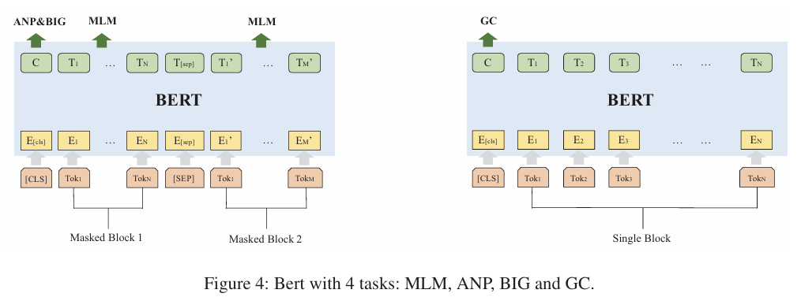
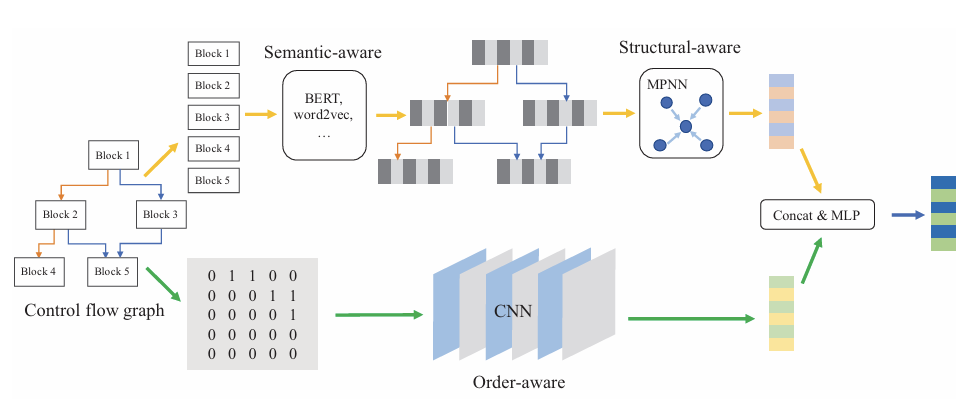

# Dataset
## Assembly Instruction Normalization
### Original Method: CP-BCS: Binary Code Summarization Guided by Control Flow Graph and Pseudo Code
+ Retain all mnemonics and registers.
+ Replace all constant values with `<Positive>`, `<Negative>`, and `<Zero>`.
+ Replace all internal functions with `<ICall>`.
+ Replace all destinations of local jumps with `<JumpAddress>`.
#### Semantic Gap Issue
The natural semantic density of assembly instructions is significantly lower than natural languages (e.g., English).  
Example: Semantic information of `mov eax, ebx` ≈ 10-20% of an English word.  
This makes it difficult for models to learn effective representations from sparse semantics.

#### Special Token Dilution Issue
After adding `<CLS>`/`<SEP>` to each block:  
+ Original instruction sequence: `["push", "ebp", "mov", "ebp", "esp"]`  
+ With special tokens (5 instructions): `["<CLS>", "push", "ebp", "mov", "ebp", "esp", "<SEP>"]`  
  Effective instruction ratio: 5/7 ≈ 71%  
+ When blocks contain few instructions, special tokens dominate (up to 30-40%), diluting effective semantics.

#### Unutilized Instruction-Level Features:
Missing considerations:  
Instruction types (arithmetic/logic/memory), register dependencies, memory operation modes.

### Optimization Plan:
#### Enhanced Semantic Representation
Explicitly encode semantic features to compress vocabulary size.
##### Map Opcodes to Categories
Original: `mov` → `data_transfer:mov`  
Add semantic categories while preserving specific opcodes.  
Helps models understand similar operations (e.g., `mov`/`lea` both belong to data transfer).
  + `data_transfer`: Data movement instructions (e.g., `mov`, `lea`, `xchg`) for copying data between registers/memory, calculating addresses, or swapping data.
  + `control_flow`: Control flow instructions (e.g., `jmp`, `call`, `ret`) for jumps, function calls, returns, and conditional branches.
  + `arith`: Arithmetic instructions (e.g., `add`, `sub`, `mul`) for integer operations.
  + `system`: System/miscellaneous instructions (e.g., `syscall`, `cpuid`, `cli`) for system calls, interrupts, I/O, and flag operations.
  + `logic`: Logic operations (e.g., `and`, `or`, `shl`) for bitwise manipulations.
  + `stack`: Stack operations (e.g., `push`, `pop`) dedicated to stack management.
  + `vector`: Vector/SIMD instructions (e.g., `vpsrld`, `paddq`) for SIMD computations (SSE/AVX).
  + `fpu`: Floating-point unit instructions (e.g., `fsqrt`, `fadd`) for floating-point operations.
  + `crypto`: Cryptographic instructions (e.g., `aes`, `sha`) for hardware-accelerated encryption.
  + `nop`: No-operation instruction (`nop`) for padding or delays.
  + `wait`: Wait instruction (`pause`) for spin-lock optimization.
  + `string`: String operations (e.g., `movs`, `scas`) for efficient memory block handling.
  + `bit_manip`: Bit manipulation (e.g., `popcnt`) for bit counting.
  + `lock_prefix`: Lock prefix (e.g., `lock xadd`) for atomic operations.
  + `rep_prefix`: Repeat prefix (e.g., `rep stosq`) for looping string operations.
  + `bounds_prefix`: Bounds prefix (e.g., `bnd jmp`) for memory protection (MPX).
  + `notrack_prefix`: No-track prefix (e.g., `notrack call`) to skip branch prediction.
  + `flag_operation`: Flag operations (e.g., `setb`, `sete`) to set values based on flags.

##### Register Category Mapping:
Original `eax` → `<REG:gpr>`  
Unifies register representations across architectures (e.g., `eax`/`rax` → `gpr`).  
Preserves category info (general-purpose/vector/FPU/etc.).
  - `gpr`: General-purpose registers (e.g., `rax`, `r15b`, `eax`) for data/address storage (8/16/32/64-bit).
  - `segment`: Segment registers (e.g., `cs`, `fs`) for memory segmentation.
  - `vector`: Vector registers (e.g., `xmm0`, `zmm15`) for SIMD operations.
  - `mmx`: MMX registers (e.g., `mm0`) for 64-bit integer vectors (legacy SIMD).
  - `fpu`: Floating-point registers (e.g., `st0`) for x87 instructions.
  - `flags`: Flag registers (e.g., `eflags`) for status flags (zero/carry/overflow).
  - `ip`: Instruction pointer (e.g., `rip`) for the next instruction address.
  - `control`: Control registers (e.g., `cr3`) for CPU mode management.
  - `debug`: Debug registers (e.g., `dr0`) for hardware breakpoints.
  - `mxcsr`: MXCSR register for SIMD floating-point control.

+ **Memory Operand Mapping**: 
  + Base register: Add `BASE` prefix: `<BASE:{register type mapping}>`
  + Index register: Add `INDEX` prefix: `<INDEX:{register type mapping}:{scale}>` (scale=1,2,4,8)
  + Displacement classification:  
    `disp < 2^8 → <DISP:small>`,  
    `disp < 2^16 → <DISP:medium>`,  
    `else → <DISP:large>`
  + Handle no base/index: `→ <ABS_MEM>`
  + Example: `[ebx+ecx*4+0x10] → [<BASE:gpr>+<INDEX:gpr:4>+<DISP:small>]`

+ **Immediate Values**: Differentiate jump targets from other immediates.  
  Immediates after jump instructions → `<TARGET>`.  
  Other immediates by bit-width:  
  `imm < 2^8 → <IMM:8bit>`,  
  `imm < 2^16 → <IMM:16bit>`,  
  `imm < 2^32 → <IMM:32bit>`,  
  `else → <IMM:64bit>`.  
  Example: `0x1234 → <IMM:16bit>` or `<TARGET>` (if jump target).

+ **Unknown Operands**: `→ <UNK_OP>`  
+ During normalization, collect unknown opcodes, registers, and operands into `unknown_opcode`, `unknown_reg`, and `unknown_operand` sets, then update mappings.

**Vocabulary Optimization Results**:
| Element Type   | Original Vocab Size | Improved Vocab Size | Reduction |
|----------------|---------------------|---------------------|-----------|
| Opcodes        | 200+                | 20+ categories      | 90%       |
| Registers      | 100+                | 6 types            | 94%       |
| Memory Disp.   | Infinite            | 3 ranges           | 100%      |
| Immediates     | Infinite            | 4 bit-widths       | 100%      |
#### Usage Example
```
; basic block 0x41d015 - 0x41d037 @ main, Dataset-1/clamav/x86-gcc-9-O3_sigtool
0x41d015: add ebx, 0x2cdfeb              => arith:add <REG:gpr>, <IMM:32bit>
0x41d01b: push ecx                       => stack:push <REG:gpr>
0x41d01c: sub esp, 0x358                 => arith:sub <REG:gpr>, <IMM:16bit>
0x41d022: mov esi, dword ptr [ecx]       => data_transfer:mov <REG:gpr>, [<BASE:gpr>]
0x41d024: mov edi, dword ptr [ecx + 4]   => data_transfer:mov <REG:gpr>, [<BASE:gpr>+<DISP:small>]
0x41d027: mov eax, dword ptr gs:[0x14]   => data_transfer:mov <REG:gpr>, [<DISP:small>]
0x41d02d: mov dword ptr [ebp - 0x1c], eax => data_transfer:mov [<BASE:gpr>+<DISP:small>], <REG:gpr>
0x41d030: xor eax, eax                   => logic:xor <REG:gpr>, <REG:gpr>
0x41d032: call 0x4226d0                  => control_flow:call <TARGET>
```

### Function-Level Processing Pipeline
1. **Binary Analysis**: Use angr to load binaries and build CFG. Locate target functions (by address/name).
2. **Function Filtering**: Discard functions with <5 or >1000 basic blocks.
3. **Basic Block Processing**: Sort blocks by address. Normalize each instruction.
4. **Control Flow Extraction**: Build adjacency matrix (sparse) to record inter-block jumps.
5. **Persistence**: Save normalized instruction sequences and adjacency matrix per function to `.pkl` files.
```python
# output_x86-gcc-9-O3_sigtool.pkl
{
    ...,
    'main': {
        ...,
        4313143: [
            'system:test <REG:gpr>, <REG:gpr>', 
            'control_flow:jne <TARGET>'
        ],
        'adjacency_matrix': <COOrdinate sparse matrix of dtype 'int64' with 318 stored elements and shape (499, 499)>,
        'addr_to_idx': {
            4313088: 0,
            4313109: 1,
            4313143: 2,
            4313151: 3,
            ...
        },
    },
    ...,
}
```
### Multi-Processing Batch Processing
1. Traverse binaries in Dataset-1 directory.
2. Select files containing x86/x64 and gcc in filenames.
3. Process in parallel using 12 workers.
4. Merge unknown items into unknown_opcode.json.

## Dataset Splitting
### Function-Level Dataset Split
1. Traverse all `.pkl` files and create a tuple for each function: (function_name, compiler, version, optimization level, filename)  
   Example: `('main', 'gcc', '8.32', 'O0', 'coreutils-8.32')`
2. Split the dataset: 63% training set, 27% validation set, 10% test set.
```python
train_val, test = train_test_split(function_list, test_size=0.1)  # 10% test set
train, val = train_test_split(train_val, test_size=0.3)          # Remaining 70% training / 30% 
```
3. Save the split results to baseline-{train/val/test}-functions.pkl
4. Generate similarity pairing table:
   + Positive sample pairs: Same function under different compilation configurations
   + Negative sample pairs: Random pairing of different functions
   + Sampling control (to prevent data explosion):
     - Training set: Max 5 positive + 5 negative per group
     - Validation set: Max 2 positive + 2 negative per group
     - Test set: Max 3 positive + 3 negative per group

| anchor_function_file                  | anchor_function_name      | anchor_compiler | anchor_version | anchor_opt | target_function_file                  | target_function_name      | target_compiler | target_version | target_opt | label |
|---------------------------------------|--------------------------|-----------------|---------------|------------|---------------------------------------|--------------------------|-----------------|---------------|------------|-------|
| x64-gcc-4.8-Os_libclamav.so.9.0.0     | FileInStream_fmap_Seek   | gcc             | 4.8           | Os         | x64-gcc-5-O0_libclamav.so.9.0.0      | FileInStream_fmap_Seek   | gcc             | 5.0           | O0         | 1     |
| x64-gcc-5-O2_libclamav.so.9.0.0       | FileInStream_fmap_Seek   | gcc             | 5.0           | O2         | x64-gcc-7-O0_libclamav.so.9.0.0      | FileInStream_fmap_Seek   | gcc             | 7.0           | O0         | 1     |
| x64-gcc-9-O2_libclamav.so.9.0.0       | FileInStream_fmap_Seek   | gcc             | 9.0           | O2         | x86-gcc-5-O3_libclamav.so.9.0.0      | FileInStream_fmap_Seek   | gcc             | 5.0           | O3         | 1     |
| x86-gcc-9-O1_libclamav.so.9.0.0       | FileInStream_fmap_Seek   | gcc             | 9.0           | O1         | x64-gcc-7-O1_libclamav.so.9.0.0      | FileInStream_fmap_Seek   | gcc             | 7.0           | O1         | 1     |
| x64-gcc-9-O2_libclamav.so.9.0.0       | FileInStream_fmap_Seek   | gcc             | 9.0           | O2         | x86-gcc-7-O0_libclamav.so.9.0.0      | FileInStream_fmap_Seek   | gcc             | 7.0           | O0         | 1     |
| x86-gcc-9-O3_libclamav.so.9.0.0       | FileInStream_fmap_Seek   | gcc             | 9.0           | O3         | x64-gcc-9-O0_libssl.so.3             | dtls1_query_mtu          | gcc             | 9.0           | O0         | 0     |
| x64-gcc-7-O0_libclamav.so.9.0.0       | FileInStream_fmap_Seek   | gcc             | 7.0           | O0         | x86-gcc-7-O2_libclamav.so.9.0.0      | .L68                     | gcc             | 7.0           | O2         | 0     |
| x86-gcc-7-O0_libclamav.so.9.0.0       | FileInStream_fmap_Seek   | gcc             | 7.0           | O0         | x86-gcc-4.8-Os_ncat                  | executable_path          | gcc             | 4.8           | Os         | 0     |
| x64-gcc-7-O0_libclamav.so.9.0.0       | FileInStream_fmap_Seek   | gcc             | 7.0           | O0         | x86-gcc-4.8-O0_ncat                  | newbox                   | gcc             | 4.8           | O0         | 0     |
| x64-gcc-5-O0_libclamav.so.9.0.0       | FileInStream_fmap_Seek   | gcc             | 5.0           | O0         | x86-gcc-4.8-O3_libclamav.so.9.0.0    | sub_793302               | gcc             | 4.8           | O3         | 0     |
### Dataset Preprocessing
1. Load the split function lists
2. Group processing by binary files
3. Function data conversion:
```python
# # Instruction block processing: Map block addresses to indices
block_addr = sorted(addr_to_idx.keys(), key=addr_to_idx.get)
# Concatenate instructions within blocks
instruction_blocks = [
    " ".join(function_data[addr])  # Join instructions within a basic block
    for addr in block_addr
]
# Process adjacency matrix (COO format) to streamable output
adj = {
    'row': adj.row.tolist(),
    'col': adj.col.tolist(),
    'data': adj.data.tolist(),
    'shape': adj.shape
}
```
4. Generate JSONL format dataset:
```json
{
"instruction_blocks": [
    "stack:push <REG:gpr> ... control_flow:call <TARGET>",
    ... , 
    "arith:add <REG:gpr>, <IMM:8bit> ... control_flow:ret"
    ], 
"adjacency_matrix": {
    "row": [4, 4, 8, 10, 10, 14, 16, 16, 20, 21, 22, 22, 24, 24, 26, 26, 27, 27], 
    "col": [5, 9, 22, 11, 15, 22, 17, 21, 22, 27, 23, 24, 25, 26, 28, 29, 28, 29], 
    "data": [1, 1, 1, 1, 1, 1, 1, 1, 1, 1, 1, 1, 1, 1, 1, 1, 1, 1], 
    "shape": [30, 30]
    }
}
{
"instruction_blocks": [
    "stack:push <REG:gpr> ... control_flow:call <TARGET>", 
    ..., 
    "arith:add <REG:gpr>, <IMM:16bit> ... control_flow:ret"
    ], 
"adjacency_matrix": {
    "row": [1, 1, 3, 5, 8, 8, 9, 9, 10, 10, 11, 11, 15, 17, 17, 19, 21, 21, 22, 22], 
    "col": [2, 4, 22, 9, 10, 11, 10, 11, 6, 11, 12, 16, 22, 18, 20, 22, 23, 24, 23, 24], 
    "data": [1, 1, 1, 1, 1, 1, 1, 1, 1, 1, 1, 1, 1, 1, 1, 1, 1, 1, 1, 1], 
    "shape": [25, 25]
    }
}
...
```
5. Create function index mapping: (function_name, compiler, version, optimization, filename) → line number mapping
```python
{
('afalg_create_sk', 'gcc', '4.8', 'O0', 'x64-gcc-4.8-O0_afalg.so'): 0,
('afalg_chk_platform', 'gcc', '4.8', 'O0', 'x64-gcc-4.8-O0_afalg.so'): 1,
('afalg_fin_cipher_aio', 'gcc', '4.8', 'O0', 'x64-gcc-4.8-O0_afalg.so'): 2,
...
}
```
6. Vocabulary construction:
   1. Initialize vocabulary:
   ```python
   vocab = {
    "<PAD>": 0, "<CLS>": 1, "<SEP>": 2, 
    "<MASK>": 3, "<UNK>": 4, "<const>": 5
    }
   ```
   2. Update vocabulary for each function's **instruction_blocks**
   3. Save vocabulary

# BERT4 Pretraining
## BERT4 Model
<div align="center">
  
</div>

+ BERT4 Config:
  - Vocab Embedding Dim: 128
  - Max Sequence Length: 128
  - Feed-forward/Hidden Dim: 256
  - Transformer Depth: 12
  - Attention Heads: 8 
  - input format: `<CLS> block1 <SEP> block2... <PAD>` (padding to max length)
## Dataset Sampling
For each epoch, 20% of the dataset is sampled without repetition for training. Once the entire dataset has been sampled, the sampling is reset.
## Masked Language Model (MLM) Task
Masks tokens on the input layer and predicts them on the output layer.
1. For each function's instruction blocks, randomly sample 50 block pairs as input sequences:  
   - For sampled block pairs, concatenate each block with next block: `<CLS> block1 <SEP> block2` to generate input sequences.
   - For each input sequences, perform random mask while ignoring `<CLS>` and `<SEP>`.  
   - 15% probability of replacement:
     - 80% replaced with `<MASK>`
     - 10% replaced with a random token
     - 10% kept unchanged

## Adjacency Node Prediction (ANP) Task
1. Generate positive and negative sample pairs based on the adjacency matrix:
   - Positive sample pairs: Adjacent basic block pairs
   - Negative sample pairs: Randomly selected non-adjacent basic block pairs
   - balanced sampling: 
     - For each positive sample, randomly select a negative sample from the same function.
     - Ensure that the number of positive and negative samples is balanced.
     - If positive sample is 0, then only negative samples are generated.
2. input: \[cls_id\] + masked_block_A_ids+ \[sep_id\] + masked_block_B_ids, label
   - cls_id: `<CLS>` token ID
   - sep_id: `<SEP>` token ID
   - masked_block_A_ids: Tokenize block A and convert to IDs, then mask tokens randomly
   - masked_block_B_ids: Tokenize block B and convert to IDs, then mask tokens randomly
   - label: 1 = adjacent, 0 = not adjacent
## Block Inside Graph (BIG) Task
1. Generate positive and negative sample pairs based on the adjacency matrix:
   - Positive sample pairs: Pairs of blocks that are in the same function (i.e., connected in the CFG).
   - Negative sample pairs: Randomly selected pairs of blocks from different functions.
   - balanced sampling: 
     - For each positive sample, randomly select a negative sample from a different function.
     - Ensure that the number of positive and negative samples is balanced.
2. input: \[cls_id\] + masked_block_A_ids+ \[sep_id\] + masked_block_B_ids, label
   - cls_id: `<CLS>` token ID
   - sep_id: `<SEP>` token ID
   - masked_block_A_ids: Tokenize block A and convert to IDs, then mask tokens randomly
   - masked_block_B_ids: Tokenize block B and convert to IDs, then mask tokens randomly
   - label: 1 = in same graph, 0 = in different graphs

## Graph Classification (GC) Task
Platform = \[x86, x64\], Optimization = \[O0, O1, O2, O3, Os\], generate combinations of these two attributes to form a graph classification task.
```python
{('O0', 'x86'): 0,
 ('O0', 'x64'): 1,
 ('O1', 'x86'): 2,
 ('O1', 'x64'): 3,
 ('O2', 'x86'): 4,
 ('O2', 'x64'): 5,
 ('O3', 'x86'): 6,
 ('O3', 'x64'): 7,
 ('Os', 'x86'): 8,
 ('Os', 'x64'): 9}
```
1. for each function, generate labels based on the mapping above.
2. in each function, randomly sample 50 blocks as input sequences:
   - For sampled blocks, add `<CLS>` at the beginning.
3. input: \[cls_id\] + block_ids, label
   - cls_id: `<CLS>` token ID
   - block_ids: Tokenize blocks and convert to IDs
   - label: Platform and optimization level combination ID

## Loss Function
- MLM loss: Uses negative log likelihood loss to compute prediction error at masked positions, ignoring `<CLS>` and `<PAD>` tokens.
- ANP, BIG, GC loss: Uses cross-entropy loss to compute prediction error for positive/negative sample pairs.
- Total loss: MLM loss + ANP loss + BIG loss + GC loss, with weights set to 1.0 for all tasks.

## TODO
- in MLM, ANP, BIG Tasks, the context size is 2, which is too small. Need to increase the context size to 3 or more. We should also generate block pairs based on cfg structure, not just adjacent blocks.
- expand platform to include more architectures (e.g., ARM, MIPS) and compilers (e.g., clang).

# Supervised Function Similarity Learning
## Model Structure

## Semantic-aware Modeling
Use pretrained BERT4 to extract semantic-aware representations of assembly instructions.
## Structural-aware Modeling
After obtaining the block embeddings from BERT pretraining, we use MPNN to compute the graph semantic & structural embedding of each CFG.
```python
class MPNN(nn.Module):
    def __init__(self, in_dim=128, hidden_dim=128, n_steps=5):
        super().__init__()
        self.n_steps = n_steps
        self.mpnn_layer = MPNNLayer(in_dim, hidden_dim)
        self.readout = nn.Sequential(
            nn.Linear(in_dim * 2, hidden_dim),
            nn.ReLU()
        )

    def forward(self, h0, adj):
        """
        Inputs:
            h0: initial node features [batch_size, num_nodes, in_dim]
            adj: adjacency matrix [batch_size, num_nodes, num_nodes]
        Output: 
            graph embedding [batch_size, hidden_dim]
        """
        h = h0
        # Run T steps of message passing
        for _ in range(self.n_steps):
            h = self.mpnn_layer(h, adj)
        
        # Read out features at step 0 and step T and concatenate
        h0_sum = torch.sum(h0, dim=1)  # [batch_size, in_dim]
        hT_sum = torch.sum(h, dim=1)   # [batch_size, in_dim]
        combined = torch.cat([h0_sum, hT_sum], dim=1)
        
        # Generate graph embedding
        return self.readout(combined)

```

## Order-aware Modeling
Resnet: 11-layer Resnet with 3 residual blocks. \
do not use any pooling methods unless on the last layer, because the inputs have different sizes.
$$ g_o = Maxpooling(Resnet(A))$$
```python
class OrderCNN(nn.Module):
    def __init__(self, in_channels=1, num_blocks=3, out_features=32):
        super().__init__()
        # Initial convolutional layer
        self.conv_in = nn.Conv2d(in_channels, 32, kernel_size=3, padding=1)
        self.bn_in = nn.BatchNorm2d(32)
        
        # Residual blocks
        self.res_blocks = nn.Sequential()
        for i in range(num_blocks):
            self.res_blocks.add_module(f"res_block_{i}", ResNetBlock(32))
        
        # Global max pooling
        self.pool = nn.AdaptiveMaxPool2d((1, 1))
        
        # Output layer
        self.fc_out = nn.Linear(32, out_features)

    def forward(self, adj):
        """
        Input: 
            adj: adjacency matrix [batch_size, num_nodes, num_nodes]
        Output: 
            order embedding [batch_size, out_features]
        """
        # Add channel dimension [batch_size, 1, num_nodes, num_nodes]
        x = adj.unsqueeze(1)
        
        # Initial convolution
        x = F.relu(self.bn_in(self.conv_in(x)))
        
        # Residual blocks
        x = self.res_blocks(x)
        
        # Global pooling [batch_size, 32, 1, 1]
        x = self.pool(x)
        
        # Flatten [batch_size, 32]
        x = x.view(x.size(0), -1)
        
        # Output layer [batch_size, out_features]
        return self.fc_out(x)
```
## Concat & MLP
```
block embedding = BERT4.encode(input IDs)
structure embedding = MPNN(block embedding, adjacency matrix) # 128 dim
order embedding = OrderCNN(adjacency matrix) # 32 dim
graph embedding = MLP(concat([structure embedding, order embedding])) # 64 dim
```
## Supervised Fine-tuning
1. define a classifier that takes the concatenated embeddings from MPNN + OrderCNN as input and predicts the similarity score between two functions.
```python
class SimilarityClassifier(nn.Module):
    def __init__(self, cfg_fusion_model, graph_hidden_dim=64):
        super().__init__()
        self.cfg_fusion_model = cfg_fusion_model
        self.classifier = nn.Sequential(
            nn.Linear(2 * graph_hidden_dim, 128),
            nn.ReLU(),
            nn.Dropout(0.3),
            nn.Linear(128, 1),
            nn.Sigmoid()
        )

    def forward(self, a_ids, a_adj, t_ids, t_adj):
        """
        a_ids: Input IDs for anchor nodes [batch_size, num_nodes, seq_len]
        a_adj: Adjacency matrix for anchor nodes [batch_size, num_nodes, num_nodes]
        t_ids: Input IDs for target nodes [batch_size, num_nodes, seq_len]
        t_adj: Adjacency matrix for target nodes [batch_size, num_nodes, num_nodes]
        Output:
            Similarity score [batch_size] 0~1
        """
        # Get graph embeddings
        a_embed = self.cfg_fusion_model(a_ids, a_adj)
        t_embed = self.cfg_fusion_model(t_ids, t_adj)
        
        # Concatenate embeddings and classify
        combined = torch.cat([a_embed, t_embed], dim=1)
        return self.classifier(combined).squeeze()
```
### Results


## Problems
adjacency matrix is too sparse, the input of model requires dense matrix, directly using converted adjacency matrix will lead to huge gpu memory usage.
### Possible Solutions
+ Implement a model which can handle sparse adjacency matrix, not solved yet.
+ select specific nodes from adjacency matrix, such as the nodes with top-k highest in- + out-degree (chosen).
+ Use spectral clustering to merge nodes into super-nodes (connectivity becomes 0~1). Note: Spectral clustering may alter graph topology (e.g., merging multiple nodes into a super-node), destroying the original node order (which the paper emphasizes as important). Thus, using spectral clustering may compromise model performance.
+ Remove isolated nodes and compress adjacency matrices to reduce computation. Isolated nodes have no connections; removing them reduces computational complexity but may lose information.

## TODO
+ Remove **part of** isolated nodes during dataset preprocessing to compress adjacency matrices and reduce computation
+ Implement a model capable of handling sparse adjacency matrices
